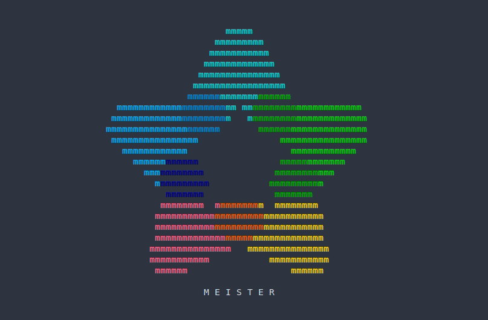

<h1 align="center">Meisterstar</h1>

<div align="center"></div>
<br>
<p align="center">
<a href="https://forthebadge.com"></a>
<a href="https://forthebadge.com"></a>
</p>


<p align="center">Inspired by <a href="https://github.com/sergiolepore/ChristBASHTree">ChristBASHTree</a></p>

## Requirements 

Meisterstar requires bash version 4 or higher, as well as a terminal emulator with 256-color support.  

## Usage

cURL:
```
curl https://raw.githubusercontent.com/hschne/meisterstar/master/meisterstar.sh | bash
```
Wget:
```
wget -qO- https://raw.githubusercontent.com/hschne/meisterstar/master/meisterstar.sh | bash
```
Git:
```
git clone git@github.com:hschne/meisterstar.git && cd ./meisterstar && bash meisterstar.sh
```

## License

[WTFPL](LICENSE) (c) [@hschne](https://github.com/hschne)
